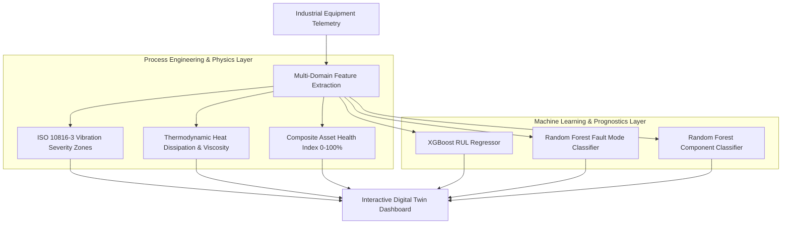

# ⚙️ Siemens Asset Digital Twin & Predictive Maintenance (PdM)

[](https://www.python.org/)
[](https://streamlit.io/)
[](https://xgboost.readthedocs.io/)
[](https://scikit-learn.org/)
[](https://www.kaggle.com/)
[](https://www.iso.org/standard/29080.html)
[](https://opensource.org/licenses/MIT)

An industrial-grade **Asset Digital Twin & Predictive Maintenance (PdM)** platform designed for CNC, Lathe, and Milling machinery. This project bridges **First-Principles Process Engineering** (Rotodynamics, ISO 10816-3 vibration severity, thermodynamics, and tribology) with **Modern Machine Learning** (XGBoost RUL prognostics and multi-class fault classification).

---

## 📊 Dataset Provenance & Attribution

The telemetry underlying this project originates from the industrial manufacturing dataset hosted on **[Kaggle.com](https://www.kaggle.com/)**.
* **Dataset Scope:** 1,578,241 continuous operational records sampled at 1-minute resolution across 3 operational years (2022–2025).
* **Equipment Monitored:** 4 Industrial Machines (`M001`–`M004`) across 3 Machine Types (`CNC`, `Lathe`, `Milling`) and 3 Production Lines (`L1`–`L3`).
* **Sensor Channels:** 91 synchronous telemetry variables spanning Rotodynamics (triaxial vibration, acoustic, ultrasonic), Thermodynamics (bearing, motor, oil, coolant temperatures), Fluid Power (pressures, flows), 3-Phase Electrical Quality (voltage, current, power factor), and Ground Truth Failure Events.
* **Repository Sample:** For immediate out-of-the-box execution without downloading gigabytes of raw data, this repository includes an optimized, balanced 35,000-row sample in `data/telemetry_sample.parquet` (14.4 MB).

---

## 📌 Executive Summary

Unplanned industrial downtime costs manufacturing facilities thousands of dollars per hour. Traditional preventative maintenance relies on static schedules that either replace components prematurely or fail to prevent catastrophic breakdowns.

This platform provides a real-time **Asset Digital Twin** that ingests multi-sensor telemetry across mechanical, thermal, fluid, and electrical domains to:
1. Assess machine condition against **ISO 10816-3 Vibration Severity** standards.
2. Calculate a real-time **Composite Health Index (0–100%)**.
3. Forecast **Remaining Useful Life (RUL)** in hours using **XGBoost**.
4. Diagnose **Failure Modes** (`Mechanical`, `Electrical`, `Software`) and pinpoint vulnerable sub-assemblies (`Bearing`, `Motor`, `Gearbox`).

---

## 🏗️ System Architecture



---

## 🔬 Process Engineering & Physical Principles

### 1. ISO 10816-3 Vibration Severity Standard
Vibration velocity RMS ($v_{RMS}$) is continuously benchmarked against standardized operational limits:
* 🟢 **Zone A (Good):** $v_{RMS} < 1.8 \text{ mm/s}$ (Newly commissioned machinery condition).
* 🔵 **Zone B (Satisfactory):** $1.8 \le v_{RMS} < 4.5 \text{ mm/s}$ (Unrestricted continuous operation).
* 🟡 **Zone C (Unsatisfactory):** $4.5 \le v_{RMS} < 7.1 \text{ mm/s}$ (Early warning; schedule inspection).
* 🔴 **Zone D (Unacceptable):** $v_{RMS} \ge 7.1 \text{ mm/s}$ (Critical risk of catastrophic failure).

### 2. Composite Asset Health Index ($H_{index}$)
A physical score calculated across 4 weighted operating domains:
$$H_{index} = 0.35 \cdot H_{vib} + 0.25 \cdot H_{therm} + 0.25 \cdot H_{oil} + 0.15 \cdot H_{elec}$$

* **$H_{vib}$ (Vibration):** Evaluates RMS and Peak vibration relative to ISO limits.
* **$H_{therm}$ (Thermal):** Tracks bearing and motor temperature differentials ($\Delta T = T_{bearing} - T_{ambient}$).
* **$H_{oil}$ (Tribology):** Quantifies lubricant degradation and solid particle contamination (ppm).
* **$H_{elec}$ (Electrical):** Analyzes 3-phase power factor ($\cos\phi$) and voltage balance.

---

## 🤖 Machine Learning Architecture

| Model Task | Algorithm | Input Dimensions | Target Output |
| :--- | :--- | :--- | :--- |
| **RUL Prognostics** | **XGBoost Regressor** | 29 Telemetry Features | Remaining Useful Life (Hours) |
| **Failure Mode** | **Random Forest** | 29 Telemetry Features | `Mechanical`, `Electrical`, `Software` |
| **Damaged Component** | **Random Forest** | 29 Telemetry Features | `Bearing`, `Motor`, `Gearbox` |

---

## 🖥️ Interactive Dashboard Features

* **Live Digital Twin Gauges:** Real-time visual gauges for Bearing Temperature, Motor Temperature, RMS Vibration, and Oil Particle Count with dynamic color-coded thresholds.
* **Proactive Prognostics Panel:** Displays ground truth vs. ML-predicted RUL and Time-to-Failure (TTF).
* **Diagnostic Radar Chart:** Multi-class probability radar revealing the most likely failure modes and vulnerable components.
* **Rolling Telemetry Historical Trends:** Synchronized multi-sensor time-series charts illustrating mechanical-thermal degradation patterns.

---

## 📂 Repository Structure

```
siemens-pdm-digital-twin/
├── app.py                      # Interactive Streamlit Digital Twin Dashboard
├── train.py                    # Model training & evaluation pipeline
├── requirements.txt            # Python dependencies
├── LICENSE                     # MIT License
├── .gitignore                  # Git ignore rules
├── .streamlit/
│   └── config.toml             # Streamlit high-contrast UI theme configuration
├── .github/
│   └── workflows/
│       └── ci.yml              # Automated GitHub Actions CI workflow
├── data/
│   └── telemetry_sample.parquet # Representative sample dataset (35k rows)
├── models/                     # Pre-trained serialized models (.pkl)
│   ├── rul_model.pkl
│   ├── fault_type_model.pkl
│   ├── fault_comp_model.pkl
│   └── feature_names.pkl
└── src/
    ├── __init__.py
    ├── data_loader.py          # Data ingestion and caching utility
    └── pdm_engine.py           # ISO 10816 physics, health index & ML engine
```

---

## 🚀 Quickstart Guide

### 1. Clone the Repository
```bash
git clone https://github.com/<your-username>/siemens-pdm-digital-twin.git
cd siemens-pdm-digital-twin
```

### 2. Create and Activate a Virtual Environment
```bash
python3 -m venv venv
source venv/bin/activate       # On Linux/macOS
# .\venv\Scripts\activate      # On Windows
```

### 3. Install Dependencies
```bash
pip install -r requirements.txt
```

### 4. Launch the Interactive Dashboard
```bash
streamlit run app.py
```
*The app will automatically open in your browser at `http://localhost:8501`.*

### 5. (Optional) Retrain the Machine Learning Models
```bash
python train.py
```

---

## 🧪 Verification & Testing

To run the automated test suite locally:
```bash
python -c "
from src.data_loader import load_data
from src.pdm_engine import load_models, classify_iso_vibration, calculate_health_index
df = load_data(nrows=100)
rul_m, ft_m, comp_m = load_models()
assert rul_m is not None, 'RUL model missing!'
zone, _ = classify_iso_vibration(2.5)
assert 'Zone B' in zone
print('✅ All tests passed successfully!')
"
```

---

## 👨‍💻 Author

**Process Engineer & Data / ML Analyst**  
*Specializing in Industrial IoT, Statistical Process Control, and Machine Learning for Manufacturing Systems.*
